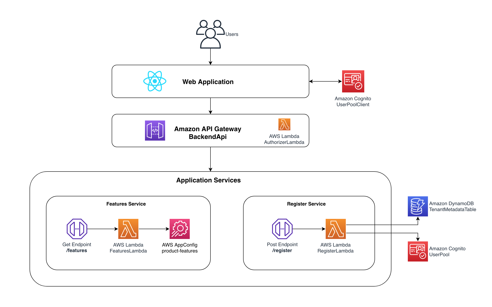
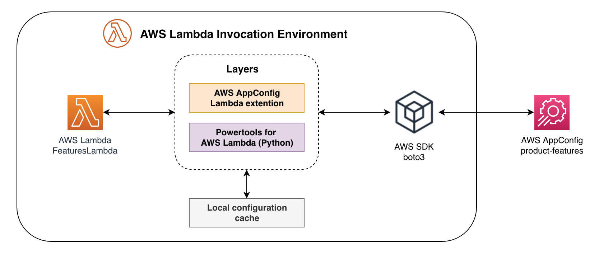

This section details the architecture of this SaaS application. Refer to [README.md](README.md) for deployment instructions.

# Overview

If you are delivering your applications as a Software as a Service (SaaS), maintaining a single version of your solution is important to keeping your operational efficiency. However, to make your offering attractive to the widest variety of customers, you also need to package your solution with flexible pricing options. Keeping your desired operational efficiency requires tools like configuration management that allow you to offer variations on your solution. 

In this hands-on coding example, we demonstrate techniques for using [AWS AppConfig](https://docs.aws.amazon.com/appconfig/latest/userguide/what-is-appconfig.html) (AppConfig) to configure our SaaS solution, allowing us to package it into pricing tiers with a variety of feature sets enabled for our tenants.

If you are already familiar with SaaS pricing tiers, skip to [What is AppConfig?](#what-is-appconfig)

## What are SaaS Pricing Tiers and why are they necessary?

Pricing tiers are a way of packaging and pricing your SaaS solution. SaaS providers can base their pricing tiers on the number of users, features, or usage; but feature based pricing models are one of the most common. 

Feature based pricing tiers provide SaaS customers options to purchase a package of features that meets their needs. These tiers also simplify customers’ decision making process. Rather than selecting from individual features, customers select from a curated group of attractive offers that bundles the features most customers use together.

For a SaaS vendor, a feature based pricing model helps them offer their services to a wider variety of customers segment such as startups, SMBs or larger enterprises. Tiers can be focused on different price points that allow vendors to move up or down market and appeal to different customers budgets and needs.

## Feature flags - why are they needed?

In order to build a tier based pricing model, SaaS vendors rely on a mechanism called feature flags. Feature flags aren’t a new concept in the software development world. If you have done trunk release, you would have used feature flags to do A/B testing. The only difference with the tier based feature flag and the A/B testing feature flags are the longevity of the flags. Flags that control pricing tier features are long-lived, and change infrequently, unlike short-lived release and experimentation flags.

# What is AppConfig?

While pricing tiers offer a structured approach to features, how do you efficiently manage and toggle these tier-specific features? You can use dynamic feature flags. Dynamic feature flags indicates something can have varying states, like enabling a list of premium features for customer X and not Y.
AppConfig dynamic configurations helps software builders quickly and securely adjust tier-specific features in production environments without constantly modifying and redeploying their application code. You can use it to manage dynamic configuration, such as pricing tiers, and store a single JSON file that contains dynamic configuration, including feature flags. These configurations can then be consumed by multiple clients within your SaaS application. See [Using AWS AppConfig to Manage Multi-Tenant SaaS Configurations](https://aws.amazon.com/blogs/mt/using-aws-appconfig-to-manage-multi-tenant-saas-configurations/) for additional details.

# Documentation

## High Level Architecture
Figure 1 represents the high-level architecture of this sample SaaS solution. It simulates a multi-tenant environment where tenants can onboard and access features based on their pricing tier. New tenants register via a public-facing Register page on a [React](https://react.dev/) app, and are processed through the `/register` endpoint in [Amazon API Gateway](https://aws.amazon.com/api-gateway/) (API Gateway), where [Amazon Cognito](https://aws.amazon.com/cognito/) (Cognito) assigns attributes and a unique ID to each tenant. Tenant allocated features are retrieved through the `/features` endpoint of the API Gateway. The experience is personalized through AppConfig, which dynamically enables features based on the tenant's pricing tier, supported through integration with [PowerTools feature flags utility](https://docs.powertools.aws.dev/lambda/python/latest/utilities/feature_flags/) and the [AppConfig Lambda extension](https://docs.aws.amazon.com/appconfig/latest/userguide/appconfig-integration-lambda-extensions.html).

<p align="center">Figure 1: High Level Architecture</p>

## Web Application

The fronted is built using React and [Amplify Libraries](https://docs.amplify.aws/lib/q/platform/js/), and represents a SaaS platform geared towards business management. It requires users to log in to access its features. The application offers two pricing tiers: basic and premium. Each tier grants the user a specific set of features.

* basic grants access to the Analytics and CRM features
* premium grants access to all features (Analytics, CRM, Email Marketing)

Figure 2 displays the user interface for a logged-in basic user, showcasing the enabled Analytics, and CRM features.

<p align="center">Figure 2: Basic User</p>

## Tenant registration

Let’s looks that how tenants can get introduced into this environment. Tenants can register themselves using the Register page in the React application, displayed in Figure 3.

<p align="center">Figure 3: Register page</p>

The registration process for a tenant is a combination of a few steps. The tenant accesses the Register page on the React application, where they provide their information, along with the tier they intend to register for (basic/premium). This kicks off the registration process by invoking the `/register` endpoint inside the API Gateway, which is an unprotected endpoint any new tenant can use to register themselves in the system.

The `/register` endpoint invokes the [register service](backend/register/register.py) deployed to [AWS Lambda](https://aws.amazon.com/lambda/) (Lambda) to create a new tenant. We used Cognito as our identity provider. The register service will create a user for the tenant inside a shared user pool. As part of creating the tenant user, we must also associate this user with tenant specific attributes to create personalized experiences (pricing tiers, tenant-aware logging, etc) within our multi-tenant SaaS environment. This is achieved through [Cognito's custom attributes](https://docs.aws.amazon.com/cognito/latest/developerguide/user-pool-settings-attributes.html). For this solution we've stored `tenant_id` as a custom attribute. The register service also stores tenant details in a shared [Amazon DynamoDB](https://aws.amazon.com/dynamodb/) (DynamoDB) table including the `tenant_id`, `tenant_name`, `tenant_tier`, and the tenant user's `fullname`.

## Logging In

After successfully registering, tenants can log in to access the features available in their respective pricing tiers. Follow these steps to log in:

1. Check your email for the login credentials sent during the registration process. Ensure to check the spam or junk folder if you can't find the email in your inbox.
2. Visit the Features page.
3. Enter your email address and the initial password provided in the email.
4. You may be prompted to change your initial password. Follow the on-screen instructions to set a new password.
5. Upon successfully setting your password, you will be redirected to the Features page.

## Authentication & Authorization

Once users are authenticated, Cognito issues a [JSON Web Token](https://jwt.io/) (JWT) that is passed with each request processed by the API Gateway. We have used an [API Gateway Lambda Authorizer](https://docs.aws.amazon.com/apigateway/latest/developerguide/apigateway-use-lambda-authorizer.html) as part of the authentication and authorization model of the environment. When a request is made to the [features service](backend/features/features.py), the [Lambda authorizer](backend/authorizer/authorizer.py) is invoked, extracting the JWT from the `Authorization header` of the request. The JWT is decoded, validated, then the `tenant_id` is utilized to query the `tenant_name`, `tenant_tier`, and the tenant user's `fullname` from the shared DynamoDB table. The Lambda authorizer constructs an authorization policy based on this authenticated user's tenant context. This sample solution allows all methods/routes as roles are not fine-grained enough to allow selectively. The extracted tenant information, alongside the user’s identity, is then passed as context to downstream services. To add efficiency to this process, the Lambda authorizer caches the credentials for a configurable duration (300 seconds in our case), based upon the JWT. So, the above steps are only executed once per 5 minutes, per JWT (or per user in other words). The number of seconds is configurable and can be customized according to your needs.

## Implementing Pricing Tiers

This sample solution uses a pooled tenant isolation model, where the [features service](backend/features/features.py) is shared by all tenants. The features service is deployed to Lambda, and leverages AppConfig for enabling SaaS pricing tiers.

### Store configuration

This solution stores the following JSON in the AppConfig hosted configuration store using a [freeform configuration profile](https://docs.aws.amazon.com/appconfig/latest/userguide/creating-feature-flags-and-configuration-data.html#appconfig-creating-configuration-and-profile-free-form-configurations).

```json
{
    "analytics": {
        "default": False,
        "rules": {
            "customer tier equals basic or premium": {
                "when_match": True,
                "conditions": [{"action": "KEY_IN_VALUE", "key": "tier", "value": ["basic", "premium"]}],
            }
        },
    },
    "crm": {
        "default": False,
        "rules": {
            "customer tier equals basic or premium": {
                "when_match": True,
                "conditions": [{"action": "KEY_IN_VALUE", "key": "tier", "value": ["basic", "premium"]}],
            }
        },
    },
    "email": {
        "default": False,
        "rules": {
            "customer tier equals premium": {
                "when_match": True,
                "conditions": [{"action": "EQUALS", "key": "tier", "value": "premium"}],
            }
        },
    }
}
```

We use the [PowerTools feature flags utility](https://docs.powertools.aws.dev/lambda/python/latest/utilities/feature_flags/), an open source feature flags library for Lambda functions, as a rule engine to evaluate when one or multiple features should be enabled depending on the input.

Let’s review the JSON structure. There are three features defined (analytics, crm, email), and each feature has a `default` value under the default key. It can have any valid JSON value (boolean, int, etc.). In addition, each feature can have optional rules determining the evaluated value. Each rule consists of a default value to return (in case of a match — `when_match` ) and a list of `conditions`. Only one rule can match. Each condition consists of an action name (mapped to an operator in the rule engine code) and a key-value pair that serves as an argument to the rule engine.

So, in this scenario, the `analytics` feature flag is turned off by default. When its rule is matched, it will be enabled. The rule is matched when the context dictionary has a key `tier` with a value of `basic` or `premium`. Similarly, the `email` feature flag is also turned off by default. When its rule is matched, it will be enabled. The rule is matched when the context dictionary has a key `tier` with a value of `premium`. 

### Fetch configuration

We use the [AppConfig Lambda extension](https://docs.aws.amazon.com/appconfig/latest/userguide/appconfig-integration-lambda-extensions.html) as a layer in our Lambda function to retrieve the configuration. The extension takes care of calling the AppConfig service, managing a local cache of retrieved data, tracking the configuration tokens needed for the next service calls, and periodically checking for configuration updates in the background. This makes calling feature flags simpler, and the extension itself includes best practices that simplify using AppConfig while reducing costs. Reduced costs result from fewer API calls to the AppConfig service and shorter Lambda function processing times. For more information about Lambda extensions, see [Lambda extensions](https://docs.aws.amazon.com/lambda/latest/dg/runtimes-extensions-api.html) in the AWS Lambda Developer Guide.

To integrate the AppConfig Lambda extension with the PowerTools feature flags utility, we created our own [store provider](backend/features/store_provider.py) by inheriting the `StoreProvider` class, and implementing both `get_raw_configuration()` and `get_configuration()` methods to retrieve the configuration from the AppConfig Lambda extension. See [Create your own store provider](https://docs.powertools.aws.dev/lambda/python/latest/utilities/feature_flags/#create-your-own-store-provider) for more details.

Figure 4 shows the integration of AppConfig Lambda extension with PowerTools feature flags utility.

<p align="center">Figure 4: Fetch Features</p>

### Examining the features service

<p align="center">backend/features.py</p>

* In lines 20-24, we initialize the AppConfigStore class to fetch configurations from AppConfig, provide it with the application, environments, and configuration names.
* In line 25, we initialize the Powertools feature flags utility.
* In line 38, we prepare the context dictionary for the feature flags utility, and set the key “tier” with the current user’s tier from the input event.
* In line 41, we fetch all the enabled feature flags based on the current user’s tier. Refer to the [documentation](https://docs.powertools.aws.dev/lambda/python/latest/utilities/feature_flags/#evaluating-a-single-feature-flag) for instructions on evaluating individual feature flags.
* In lines 45-58, the list of all enabled features is returned to the React application. This is then used to render the respective components.

This approach of sending a list of enabled features for frontend rendering is suitable for sample solutions. However, for a more secure solution, it's essential to incorporate backend-driven logic to control feature access based on authenticated user roles and permissions. 

# Added complexity to the code base

In normal circumstances, introducing A/B testing feature flags will create complexity in your code. Your code base can become littered with conditional flows creating additional complexity and making it a nightmare for your developers or configuration managers to maintain the code. If the feature flags aren’t documented properly, your team might turn on or turn off the flags accidentally. Hence, it is imperative to clean up the short-lived feature flags as soon as you are done with A/B testing. 

However, in SaaS context, feature flags are essential part of the pricing model. Feature flags should remain in your code, as long as the SaaS tiers remains in your pricing model. You will also need a mechanism to identify if the feature flags are meant for A/B testing or long-lived. SaaS tier flags part of your regular software operations and you should keep them around indefinitely. Your team shouldn’t confuse the tier bundles with A/B testing flags and accidentally flip either of them. 

Additionally, with feature flags embedded in the codebase, your continuous delivery process becomes more complex with regard to running the integration test suites. Your test cases will need to test multiple code paths for the same micro service as it moves the deployment pipeline. If test cases aren’t configured with all possible enumerated values of a feature flag, some portion of the code may never be tested.  

Hence, you need mechanisms and supporting tools to reduce the complexity of your code base and managing the lifecycle of short-term and long-term feature flags. This cross-cutting concern will add overhead to your development team and take then away from innovating on behalf of your customers.

While it is possible to manage, store and deploy configuration using a custom solution like a database or a flat file, AppConfig is a purpose built service to manage configurations. It helps with schema validation to ensure configuration quality, supports various deployment strategy like canary deployments, out of the box automatic roll back triggered by [Amazon CloudWatch](https://aws.amazon.com/cloudwatch/) alarms, serverless and in-built versioning. 

# Conclusion

This document explored the core elements of a SaaS sample solution by providing a summary of the building blocks used in the overall experience. It should give you a better sense of how the application is built and allow you to more easily navigate the resources in the repository.

We encourage you to dig into the code and provide feedback. We expect to continue to make enhancements to the solution and address new strategies as they emerge.
