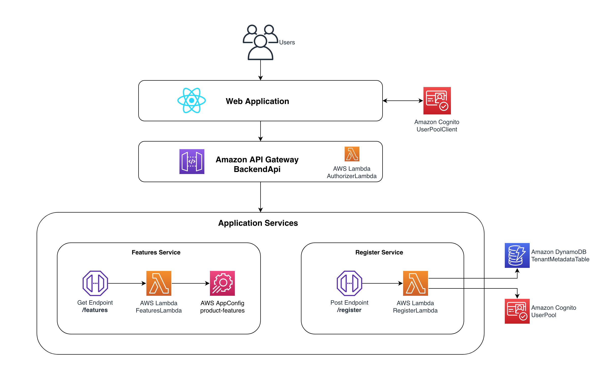

# Leveraging AWS AppConfig for Enabling SaaS Pricing Tiers

**[Documentation](DOCUMENTATION.md)**

## Introduction

If you are delivering your applications as a Software as a Service (SaaS), maintaining a single version of your solution is important to keeping your operational efficiency. However, to make your offering attractive to the widest variety of customers, you also need to package your solution with flexible pricing options. Keeping your desired operational efficiency requires tools like configuration management that allow you to offer variations on your solution. 

In this hands-on coding example, we demonstrate techniques for using [AWS AppConfig](https://docs.aws.amazon.com/appconfig/latest/userguide/what-is-appconfig.html) (AppConfig) to configure our SaaS solution, allowing us to package it into pricing tiers with a variety of feature sets enabled for our tenants.

The goal is to provide SaaS developers and architects with working code that illustrates how to use AppConfig in designing SaaS solutions without going to the extent of making a full, production-ready solution. Instead, we're hoping this can jump start your process and address some of the common challenges that you may face.

The instructions below are intended to give you a step-by-step walk through for getting this solution up and running in your own AWS account. For a general description and overview of the solution, please see the [developer's documentation](DOCUMENTATION.md).

> **Note** : This is not production grade and simply meant as a hands-on coding example.

## High Level Architecture

Figure 1 represents the high-level architecture of this sample SaaS solution. As mentioned before, please see the [developer's documentation](DOCUMENTATION.md) to understand the architecture in more detail.

<p align="center">Figure 1: High Level Architecture</p>

## Prerequisites

Before you begin, ensure you have:

* An [AWS Account](https://portal.aws.amazon.com/gp/aws/developer/registration/index.html) with the appropriate permissions.
* [AWS CLI](https://aws.amazon.com/cli/) configured.
* [Python 3+](https://www.python.org/downloads/)
* [Node and NPM](https://nodejs.org/en/download/)
* [Docker](https://docs.docker.com/engine/install/) running. This is due to the project's dependency on `aws-cdk.aws-lambda-python-alpha`, which leverages Docker for bundling Python Lambda functions. ([More information on aws-lambda-python-alpha](https://docs.aws.amazon.com/cdk/api/v2/docs/aws-lambda-python-alpha-readme.html)).

## Supported Regions

Deploy this sample in:

- us-east-1 (Default region)
- us-east-2
- us-west-1
- us-west-2

## Getting Started

### 1. Environment Setup

Clone the repository

```bash
git clone git@github.com:aws-samples/leveraging-aws-appconfig-for-enabling-saas-pricing-tiers.git
```

Move into the cloned repository

```bash
cd leveraging-aws-appconfig-for-enabling-saas-pricing-tiers
```

- For [AWS Cloud9](https://aws.amazon.com/cloud9/) (Cloud9) users

	We recommend selecting an instance type of at least `t3.small`

	Resize the [Amazon EBS](https://docs.aws.amazon.com/cloud9/latest/user-guide/move-environment.html) volume to 20 GiB

	```bash
	chmod +x resize.sh
	./resize.sh 20
	```

	Reboot the instance. It could take a minute or two for the IDE to come back online

	```bash
	sudo reboot
	```

Create and activate a virtual environment:

```bash
python3 -m venv .venv
source .venv/bin/activate
```

Set the `AWS_DEFAULT_REGION` environment variable to determine the AWS region to deploy the resources. Ensure the chosen region is supported.

```bash
export AWS_DEFAULT_REGION=REGION
```

Install the necessary dependencies

```bash
pip install -r requirements.txt
```

(Optional) Bootstrap [AWS CDK](https://aws.amazon.com/cdk/) (CDK) on the target account and region

> **Note**: This is required if you have never used CDK before on this account and region combination. ([More information on CDK bootstrapping](https://docs.aws.amazon.com/cdk/latest/guide/cli.html#cli-bootstrap)).

```bash
cdk bootstrap aws://{ACCOUNT-NUMBER}/{REGION}
```

### 2. Deployment with CDK

Deploy the application using CDK, ensuring deployment in the supported regions

```bash
cdk deploy --all
```

After a successful deployment, take note of the displayed values: `BackendStack.BackendApiURL`, `IdentityStack.UserPoolId`, and `IdentityStack.UserPoolClientId`. You will use them in the next step.

> **Note**: You can also retrieve these values by visiting the [AWS CloudFormation](https://aws.amazon.com/cloudformation/) console. Select the appropriate stack (e.g., BackendStack, IdentityStack) and navigate to the “Outputs” tab to view these details.

### 3. Configuring the React App

Move into the app directory

```bash
cd app/
```

Update `app/src/aws-exports.js` with your specific AWS resource details from the previous step

```js
const config = {
    region: 'YOUR_REGION',
    api_gateway: {
        regional_endpoint: 'YOUR_API_URL',
    },
    user_pool_id: 'YOUR_USER_POOL_ID',
    user_pool_client_id: 'YOUR_USER_POOL_CLIENT_ID',
};

export default config;
```

Install dependencies and run the app locally

```bash
npm install
npm run start
```

## Understanding the CDK code

The application is structured into four CDK stacks, each deploying and managing specific resources. The  file serves as the entry point for deploying these stacks.

> **Note**: In this sample application, `RemovalPolicy.DESTROY` is used to ensure that the AWS resources created are automatically removed when the stack is deleted. This is helpful in maintaining a clean testing environment and avoiding unwanted costs. Consider `RemovalPolicy.RETAIN` or `RemovalPolicy.SNAPSHOT` for production environments to safeguard against accidental data loss. ([More information on RemovalPolicy](https://docs.aws.amazon.com/cdk/api/v2/docs/aws-cdk-lib.RemovalPolicy.html)).

* [backend_stack.py](stacks/backend_stack.py) configures and deploys [AWS Lambda](https://aws.amazon.com/lambda/), [Amazon API Gateway](https://aws.amazon.com/api-gateway/), and related resources.
* [identity_stack.py](stacks/identity_stack.py) configures and deploys [Amazon Cognito](https://aws.amazon.com/cognito/).
* [data_stack.py](stacks/data_stack.py) configures and deploys [Amazon DynamoDB](https://aws.amazon.com/dynamodb/).
* [config_stack.py](stacks/config_stack.py) configures and deploys AppConfig.

## Clean up

Avoid unwanted charges by cleaning up the resources you've created. To do so, navigate to the root of the repository and run:

```bash
cdk destroy --all
```

> **Note**: If you used Cloud9 to deploy the architecture, then make sure to delete that instance. This will not be done by the command, and will need to be done manually.

## Security

See [CONTRIBUTING](CONTRIBUTING.md#security-issue-notifications) for more information.

## License

This library is licensed under the MIT-0 License. See the [LICENSE](LICENSE) file.
